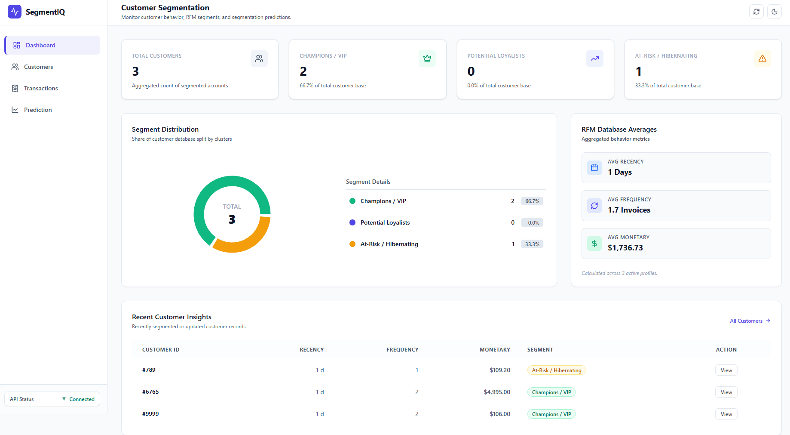
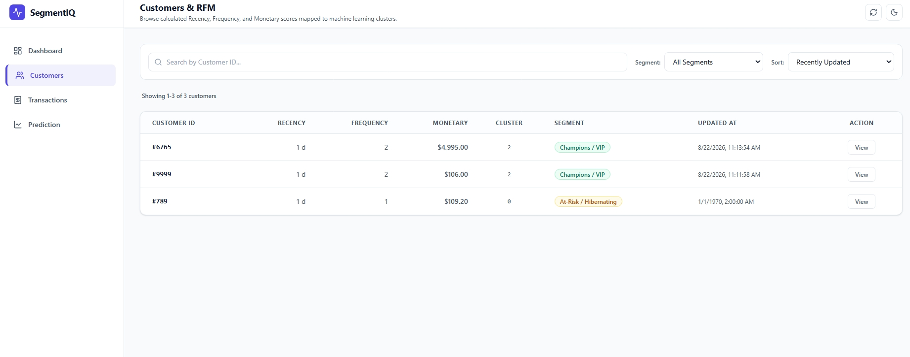
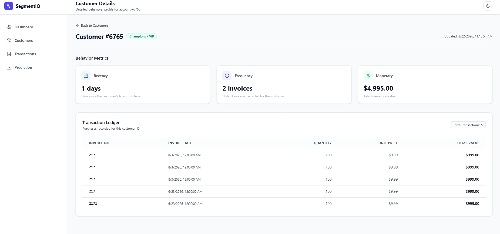
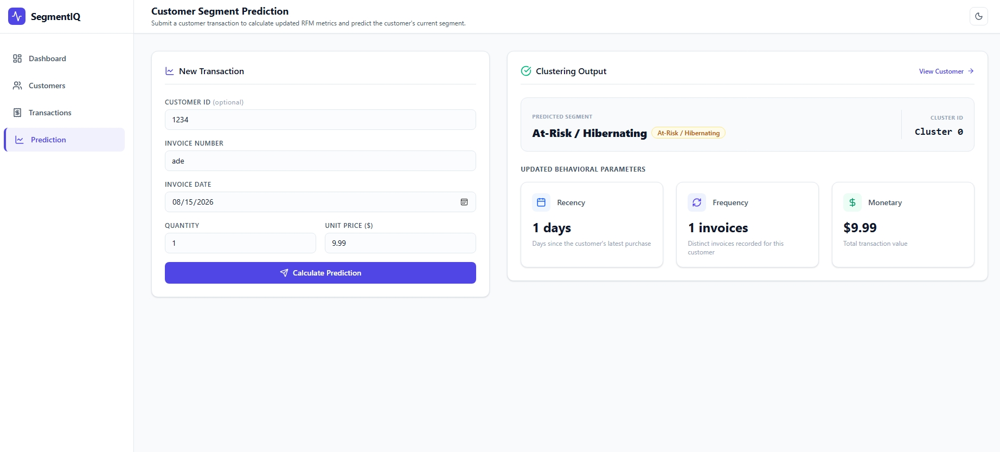

# End-to-End Customer Segmentation System

An advanced, end-to-end Customer Segmentation system that seamlessly integrates Machine Learning, a FastAPI backend, a database, and an interactive React frontend dashboard to bridge the gap between predictive modeling and actionable business insights.

---

## Table of Contents
1. [Project Overview](#project-overview)
2. [System Architecture & Data Flow](#system-architecture--data-flow)
3. [Machine Learning & Modeling](#machine-learning--modeling)
4. [Backend & Database](#backend--database)
5. [Frontend Dashboard & User Flow](#frontend-dashboard--user-flow)
6. [Application Screenshots](#application-screenshots)
7. [Live Demo](#live-demo)

---

## 1. Project Overview

This project is an end-to-end **Customer Segmentation System** that combines Machine Learning, a backend API, a database, and an interactive frontend dashboard. 

The system takes raw retail transaction data, transforms it into customer-level RFM features, applies a K-Means clustering model, and presents the resulting customer segments through an interactive web application.

The main idea of the application is to connect the Machine Learning model with an understandable business interface. Instead of exposing the user directly to raw model outputs (like `Cluster 2`), the system translates them into meaningful business segments (like `Champions / VIP`) displayed across an intuitive 3-tier analysis flow:
- **Dashboard View** (High-level business insights)
- **Customer Level** (Individual customer profiles and history)
- **Transaction Level** (Granular purchase data)

---

## 2. System Architecture & Data Flow

```text
Raw Transaction Data
        ↓
Data Cleaning & RFM Feature Engineering (Recency, Frequency, Monetary)
        ↓
Customer-Level Data
        ↓
K-Means Customer Segmentation & Scaler/Encoder Pipeline
        ↓
FastAPI Backend & Database
        ↓
React Frontend Dashboard
        ↓
Business Insights & Customer Management
```

---

## 3. Machine Learning & Modeling

The machine learning pipeline processes historical transaction data to categorize customers based on purchasing behavior:
- **RFM Extraction:** Computes Recency, Frequency, and Monetary metrics for every customer.
- **Preprocessing:** Utilizes feature scaling and encoding to prepare data for clustering.
- **Clustering:** Implements the **K-Means** algorithm to group customers into distinct behavioral segments (e.g., Champions, Potential Loyalists, At-Risk).
- **Prediction Pipeline:** Exposes endpoints to process new customer metrics and assign them to their respective clusters instantly.

---

## 4. Backend & Database

- **FastAPI Framework:** Powers the backend API, serving model predictions, customer data, and analytical metrics.
- **Data Management:** Handles data retrieval from the database, feeding clean and structured information directly to the frontend interface.

---

## 5. Frontend Dashboard & User Flow

The website is structured around three main levels of analysis:

### 1. Dashboard
Provides a high-level overview of the customer segmentation results:
- Total Customers & Segment Counts (Champions/VIP, Potential Loyalists, At-Risk/Hibernating)
- Segment Distribution (visualized using charts)
- Average RFM Metrics (Recency, Frequency, Monetary)
- Recent Customer Insights

### 2. Customers
Connects aggregate business views with individual customer profiles:
- Browse all customers and select specific profiles
- Inspect individual customer information, assigned segment, and RFM scores
- View specific transaction history tied to that customer

### 3. Transactions
Provides access to granular transaction-level data:
- Inspect individual invoices, dates, quantities, unit prices, and total transaction values
- Connects high-level customer segments back to the raw purchasing events

### Complete User Flow
```text
                    ┌──────────────┐
                    │   Dashboard  │
                    └──────┬───────┘
                           ↓
                 Overall Segmentation
                           ↓
                    ┌──────────────┐
                    │   Customers  │
                    └──────┬───────┘
                           ↓
                  Select Specific Customer
                           ↓
                ┌─────────────────────┐
                │ Customer RFM Profile │
                │ + Segment + History │
                └──────────┬──────────┘
                           ↓
                    ┌──────────────┐
                    │ Transactions │
                    └──────────────┘
                           ↓
                  Transaction Details
```
## Future Improvements

- **Churn Clustering Integration:** Implementing advanced clustering and predictive models specifically for customer churn analysis to identify at-risk customers before they churn and proactively target them with retention strategies.
- **Enhanced Real-time Analytics:** Scaling the backend processing pipeline to handle live streaming transaction data for instant segment updates.
- **Advanced Recommendation System:** Integrating personalized product recommendations based on customer segment behavior.
---

## 6. Application Screenshots

Here is a preview of the application interface across its main sections:

### Overview & General View


### Customers Directory


### Customer Details


### Transactions View


### Prediction & Pipeline View



---

## 7. Live Demo
You can access the live application here: [Customer Segmentation App](https://fcustomer-segmentation12menna.vercel.app)
