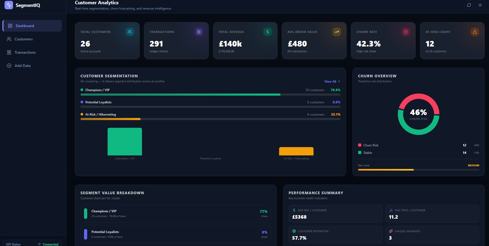
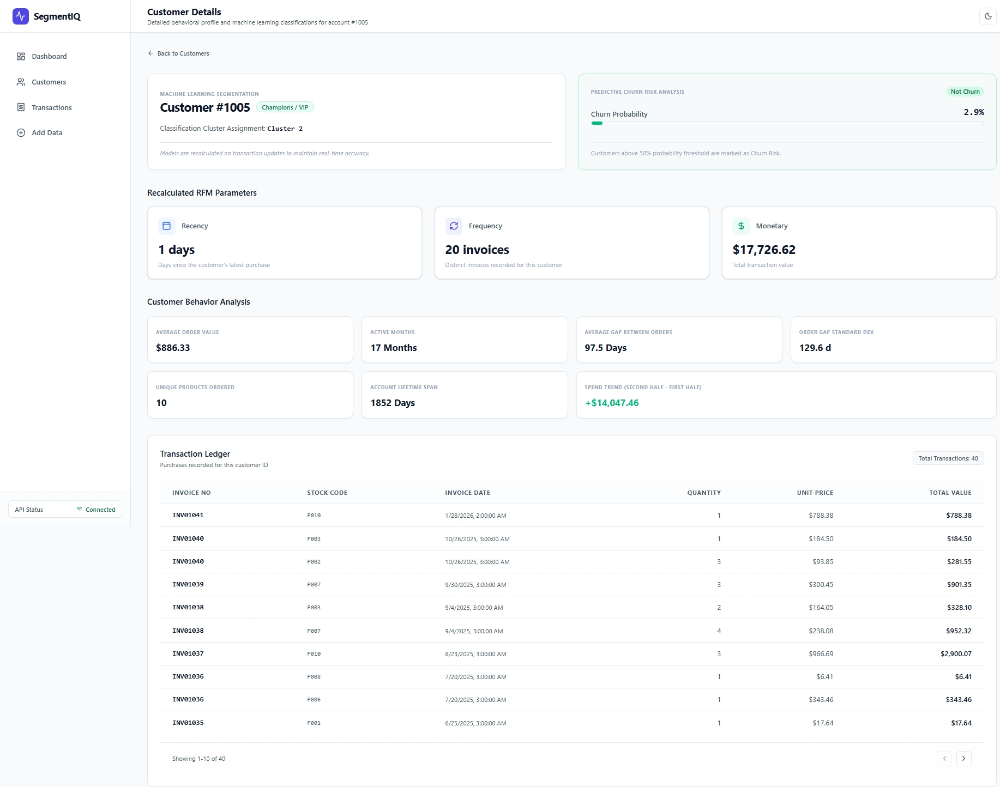
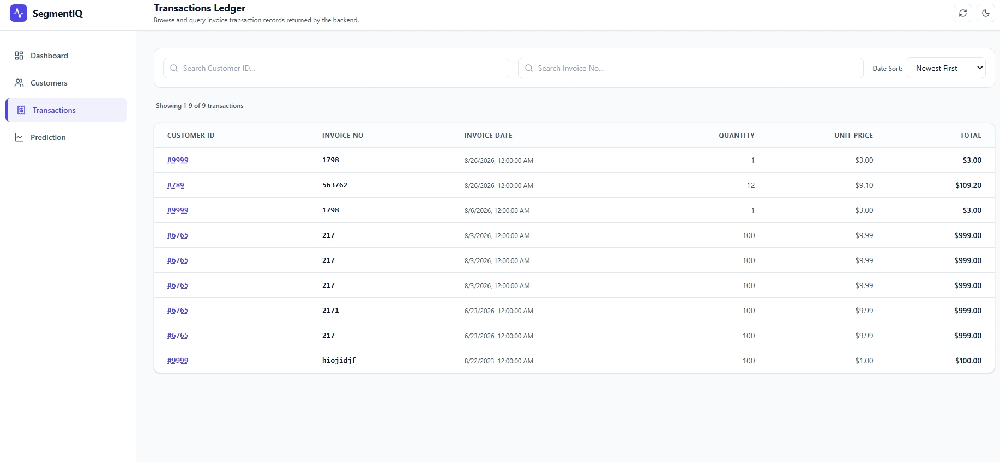
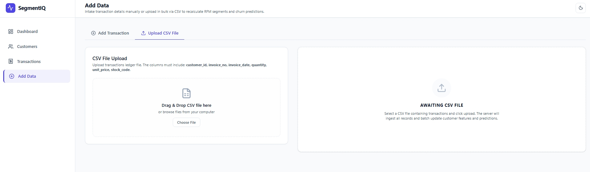
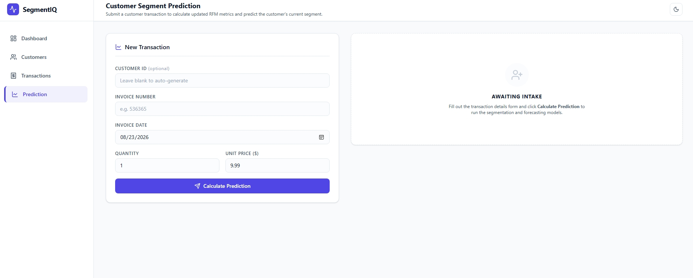

# End-to-End Customer Segmentation & Churn Prediction System

An advanced, end-to-end **Customer Analytics System** that seamlessly integrates Machine Learning, a FastAPI backend, a database, and an interactive React frontend dashboard to bridge the gap between predictive modeling and actionable business insights.

The system combines two independent Machine Learning solutions:

- **Customer Segmentation:** Groups customers based on their purchasing behavior.
- **Churn Prediction:** Predicts the probability that a customer will churn and identifies customers who may require retention actions.

---

## Table of Contents

1. [Project Overview](#project-overview)
2. [System Architecture & Data Flow](#system-architecture--data-flow)
3. [Machine Learning & Modeling](#machine-learning--modeling)
4. [Backend & Database](#backend--database)
5. [Frontend Dashboard & User Flow](#frontend-dashboard--user-flow)
6. [Application Screenshots](#application-screenshots)
7. [Live Demo](#live-demo)
8. [Future Improvements](#future-improvements)

---

## 1. Project Overview

This project is an end-to-end **Customer Analytics System** that combines Machine Learning, a FastAPI backend, a PostgreSQL database, and an interactive React frontend.

The system processes customer transaction data and transforms it into customer-level behavioral features. These features are then used by two independent Machine Learning pipelines:

1. **Customer Segmentation**
   - Uses RFM and behavioral features.
   - Applies a K-Means clustering model.
   - Assigns customers to meaningful business segments such as:
     - Champions / VIP
     - Potential Loyalists
     - At-Risk / Hibernating

2. **Churn Prediction**
   - Uses customer behavioral and purchase-pattern features.
   - Applies a supervised classification model.
   - Predicts the customer's churn probability.
   - Classifies the customer as either:
     - Churn
     - Not Churn

The application connects these two predictions at the **customer level**, allowing users to understand both:

> **Who the customer is from a behavioral perspective, and whether they are likely to churn.**

Instead of exposing raw Machine Learning outputs such as `Cluster 2` or a probability score alone, the system translates predictions into understandable business insights.

The application follows a 3-tier analysis flow:

- **Dashboard View** — High-level business insights
- **Customer Level** — Individual customer profile, segmentation, and churn prediction
- **Transaction Level** — Detailed purchase history

---

## 2. System Architecture & Data Flow

```text
                     Raw Transaction Data
                              ↓
                    Data Cleaning & Processing
                              ↓
                    Customer Transaction Data
                              ↓
                    RFM & Behavioral Features
                              ↓
             ┌────────────────┴────────────────┐
             ↓                                 ↓
   Customer Segmentation                 Churn Prediction
       K-Means Model                 Classification Model
             ↓                                 ↓
     Customer Segment                 Churn Probability
     (VIP / Loyal / Risk)             (Churn / Not Churn)
             └────────────────┬────────────────┘
                              ↓
                       PostgreSQL Database
                              ↓
                         FastAPI Backend
                              ↓
                         React Frontend
                              ↓
                   Business Insights & Actions
```
## Future Improvements

- **Adding Authentication:** Implement secure user authentication and authorization to protect customer data and restrict access to the application.
---

## 6. Application Screenshots

Here is a preview of the application interface across its main sections:

### Overview & General View


### Customers Directory


### Customer Details


### Transactions View


### Prediction & Pipeline View



---

## 7. Live Demo
You can access the live application here: [Customer Segmentation App](https://fcustomer-segmentation12menna.vercel.app)
